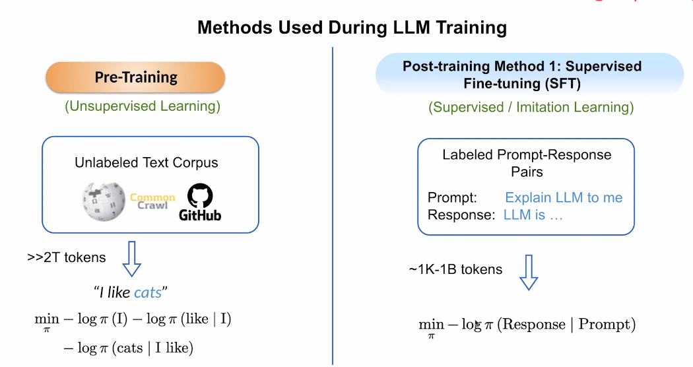
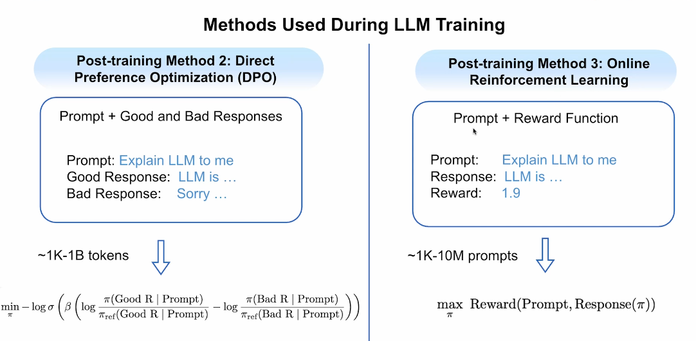
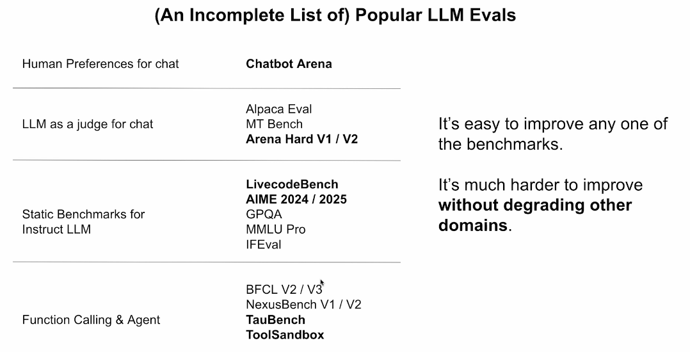
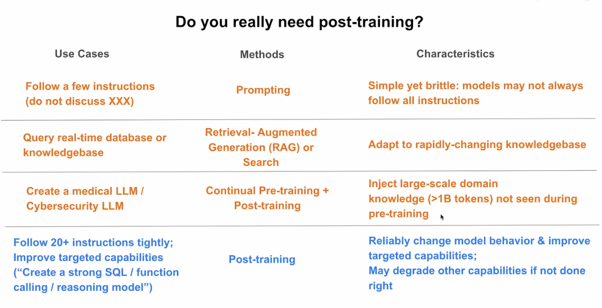

# 1. Introduction au post-training des LLM

[← Retour au README](../README.md)

## Introduction

Le développement d’un grand modèle de langage se déroule généralement en plusieurs étapes.

Le **pré-entraînement** lui permet d’apprendre les structures générales du langage et de nombreuses connaissances à partir d’un immense corpus de textes.

Le **post-entraînement** sert ensuite à transformer ce modèle généraliste en un système plus utile, capable de suivre des instructions, dialoguer, raisonner ou utiliser des outils.

---

## Pré-entraînement et post-entraînement



*Cette diapositive compare le pré-entraînement sur des textes non étiquetés avec le Supervised Fine-Tuning réalisé à partir de paires prompt-réponse.*

## 1. Le pré-entraînement : prédire le prochain token

Pendant le pré-entraînement, le modèle apprend à partir d’un très grand corpus de textes non étiquetés.

Exemples de sources :

- Wikipédia ;
- Common Crawl ;
- GitHub ;
- livres ;
- articles ;
- pages web.

Le cours évoque un volume supérieur à :

```text
2 000 milliards de tokens
```

> **Pré-entraînement** : première phase pendant laquelle le modèle apprend les structures générales du langage.

> **Corpus** : grande collection de textes utilisée pour entraîner un modèle.

> **Texte non étiqueté** : texte brut auquel aucune réponse correcte n’a été ajoutée manuellement.

> **Token** : petite unité de texte, comme un mot, une partie de mot ou un signe de ponctuation.

### Exemple

À partir de la phrase :

```text
I like cats
```

le modèle apprend à prédire successivement :

```text
I
```

puis :

```text
like
```

en ayant déjà vu :

```text
I
```

puis :

```text
cats
```

en ayant déjà vu :

```text
I like
```

Il apprend donc à estimer la probabilité du prochain token en fonction du contexte précédent.

> **Probabilité conditionnelle** : probabilité d’un événement en tenant compte des informations déjà observées.

---

## La fonction de perte

Pendant l’entraînement, le modèle compare sa prédiction avec le token réellement présent dans le texte.

Une fonction de perte mesure l’erreur produite.

> **Fonction de perte** : mesure numérique indiquant à quel point la prédiction du modèle est incorrecte.

Le pré-entraînement utilise notamment la log-vraisemblance négative.

> **Log-vraisemblance négative** : fonction qui pénalise le modèle lorsqu’il attribue une faible probabilité au bon token.

En répétant cette tâche sur d’immenses volumes de données, le modèle apprend :

- la grammaire ;
- le vocabulaire ;
- les relations entre les mots ;
- des connaissances générales ;
- des structures de raisonnement présentes dans les textes.

Cependant, il apprend surtout à **continuer un texte**.

Il ne sait pas encore nécessairement :

- suivre précisément une instruction ;
- répondre de manière utile ;
- dialoguer naturellement ;
- respecter des règles complexes ;
- utiliser des outils.

---

## 2. Le post-entraînement : apprendre à répondre

Après le pré-entraînement, le post-entraînement vise à rendre le modèle plus utile et mieux adapté aux demandes humaines.

> **Post-entraînement** : phase qui modifie ou améliore le comportement d’un modèle déjà pré-entraîné.

Le post-entraînement peut notamment améliorer :

- le suivi d’instructions ;
- le dialogue ;
- le raisonnement ;
- la programmation ;
- l’utilisation d’outils ;
- la sécurité ;
- le respect d’un format de sortie.

---

## Supervised Fine-Tuning

La première méthode présentée est le **Supervised Fine-Tuning**.

> **SFT — Supervised Fine-Tuning** : entraînement supervisé à partir d’exemples contenant un prompt et une réponse idéale.

Exemple :

```text
Prompt :
Explain LLM to me

Réponse idéale :
A large language model is...
```

> **Prompt** : question ou instruction envoyée au modèle.

> **Donnée étiquetée** : exemple pour lequel la réponse correcte ou attendue est déjà fournie.

> **Paire prompt-réponse** : instruction accompagnée de la réponse que le modèle doit apprendre à reproduire.

Le modèle apprend à imiter les réponses de qualité présentes dans les données.

Le volume de données utilisé est généralement bien inférieur à celui du pré-entraînement.

Le cours indique environ :

```text
1 000 à 1 milliard de tokens
```

Pendant le SFT, le prompt sert de contexte, mais la fonction de perte est généralement calculée uniquement sur les tokens de la réponse.

```text
Prompt
  ↓ contexte

Réponse idéale
  ↓ calcul de la perte
```

En résumé :

```text
Pré-entraînement
→ apprendre à prédire du texte

SFT
→ apprendre à répondre correctement
```

---

## Les principales méthodes de post-entraînement



*Cette diapositive compare la Direct Preference Optimization, fondée sur des réponses préférées et rejetées, avec le reinforcement learning en ligne, fondé sur une fonction de récompense.*

## Direct Preference Optimization

La **DPO** apprend au modèle à préférer une bonne réponse à une mauvaise réponse pour un même prompt.

> **DPO — Direct Preference Optimization** : méthode de post-entraînement fondée sur des préférences entre plusieurs réponses.

Exemple :

```text
Prompt :
Explique-moi ce qu’est un LLM.

Réponse préférée :
Un LLM est un modèle...

Réponse rejetée :
Désolé, je ne peux pas répondre.
```

Le modèle apprend à :

- augmenter la probabilité de la réponse préférée ;
- diminuer la probabilité de la réponse rejetée.

> **Donnée de préférence** : exemple indiquant quelle réponse est meilleure parmi plusieurs possibilités.

Le cours indique un volume pouvant aller d’environ :

```text
1 000 à 1 milliard de tokens
```

---

## Le modèle de référence en DPO

La DPO compare généralement le modèle entraîné à une ancienne version stable appelée modèle de référence.

> **Modèle de référence** : version fixe du modèle utilisée pour empêcher des changements trop importants pendant l’entraînement.

Le paramètre bêta contrôle l’ampleur de l’écart autorisé.

> **Bêta — β** : paramètre contrôlant à quel point le modèle peut s’éloigner du modèle de référence.

L’objectif général est :

```text
Préférer la bonne réponse
sans modifier excessivement
le comportement général du modèle
```

---

## Reinforcement Learning en ligne

Dans le reinforcement learning en ligne, le modèle génère lui-même une réponse pendant l’entraînement.

Cette réponse reçoit ensuite une récompense.

> **Reinforcement Learning** : méthode dans laquelle un modèle apprend grâce à des récompenses ou des pénalités.

> **En ligne** : les réponses utilisées pour apprendre sont générées pendant l’entraînement.

Le processus est le suivant :

```text
1. Recevoir un prompt
2. Générer une réponse
3. Évaluer cette réponse
4. Attribuer une récompense
5. Ajuster le modèle
6. Recommencer
```

Le cours évoque environ :

```text
1 000 à 10 millions de prompts
```

ou davantage selon le système.

---

## Origine des récompenses

Une récompense peut mesurer :

- l’exactitude ;
- le respect des instructions ;
- la qualité du raisonnement ;
- la sécurité ;
- la réussite d’une tâche ;
- le respect d’un format ;
- l’utilisation correcte d’un outil.

> **Fonction de récompense** : système qui attribue un score à une réponse.

> **Modèle de récompense** : modèle entraîné pour noter les réponses produites par un autre modèle.

> **LLM juge** : modèle de langage utilisé pour évaluer les réponses d’un autre modèle.

---

## DPO et reinforcement learning : différence principale

Avec la DPO, les réponses sont déjà fournies dans les données :

```text
Voici deux réponses.
Apprends à préférer la meilleure.
```

Avec le reinforcement learning en ligne, le modèle génère une nouvelle réponse puis reçoit une note :

```text
Génère une réponse.
Reçois une récompense.
Améliore-toi.
```

| Méthode | Données utilisées | Signal d’apprentissage |
|---|---|---|
| SFT | Prompt et réponse idéale | Imitation |
| DPO | Bonne et mauvaise réponses | Préférence |
| Reinforcement Learning | Réponse générée pendant l’entraînement | Récompense |

---

## Évaluer un modèle post-entraîné



*Cette diapositive présente plusieurs familles d’évaluations : préférences humaines, LLM comme juge, benchmarks statiques et tests d’agents ou d’appels de fonction.*

Après un post-entraînement, il faut vérifier que le modèle s’est réellement amélioré.

Une seule métrique ne suffit généralement pas.

---

## Chatbot Arena et préférences humaines

Dans une évaluation de type Chatbot Arena, deux modèles répondent au même prompt.

Un utilisateur choisit ensuite la meilleure réponse.

> **Préférence humaine** : choix effectué par une personne selon la clarté, la pertinence ou l’utilité d’une réponse.

Cette méthode permet d’évaluer la qualité conversationnelle réelle.

---

## LLM comme juge

Un autre modèle peut également comparer ou noter les réponses.

Exemples cités dans le cours :

- AlpacaEval ;
- MT-Bench ;
- Arena-Hard.

Cette méthode est plus rapide et moins coûteuse que l’évaluation humaine.

Elle peut cependant présenter des biais.

> **Biais** : tendance systématique d’un évaluateur à favoriser certains styles, formats ou modèles.

---

## Benchmarks statiques

Un benchmark statique utilise un ensemble fixe de questions identiques pour tous les modèles.

> **Benchmark** : test standardisé utilisé pour comparer plusieurs modèles.

> **Benchmark statique** : ensemble fixe de questions et de réponses utilisé de manière identique pour chaque modèle.

Exemples :

- **LiveCodeBench** : programmation ;
- **AIME** : mathématiques ;
- **GPQA** : raisonnement et connaissances scientifiques ;
- **MMLU Pro** : connaissances générales et raisonnement ;
- **IFEval** : suivi précis des instructions.

---

## Évaluation des outils et des agents

Certains benchmarks évaluent la capacité du modèle à utiliser des outils.

Exemples :

- BFCL ;
- NexusBench ;
- TauBench ;
- ToolSandbox.

Ces tests vérifient notamment si le modèle peut :

- choisir le bon outil ;
- appeler une fonction avec les bons paramètres ;
- comprendre le résultat retourné ;
- conserver le contexte ;
- planifier plusieurs actions.

> **Appel de fonction** : action par laquelle un modèle déclenche un outil informatique avec des paramètres structurés.

> **Agent** : système capable de planifier plusieurs étapes et d’utiliser différents outils pour atteindre un objectif.

---

## Pourquoi utiliser plusieurs évaluations ?

Améliorer une compétence peut parfois en dégrader une autre.

Par exemple, un entraînement ciblé sur les mathématiques peut améliorer les scores mathématiques tout en réduisant :

- la qualité du dialogue ;
- le suivi d’instructions ;
- la programmation ;
- les connaissances générales.

> **Dégradation** : diminution des performances dans un domaine auparavant maîtrisé.

L’objectif est donc d’améliorer une capacité précise sans détériorer les autres compétences du modèle.

---

## Faut-il vraiment utiliser le post-entraînement ?



*Cette diapositive aide à choisir la méthode adaptée selon le besoin : prompting, RAG, pré-entraînement continu ou post-entraînement.*

Le post-entraînement n’est pas toujours la meilleure solution.

Le choix dépend du problème à résoudre.

---

## Quelques règles simples : prompting

Pour ajouter quelques consignes simples, il suffit parfois de les écrire directement dans le prompt.

> **Prompting** : méthode qui guide le modèle uniquement grâce à des instructions textuelles, sans modifier ses poids.

Exemple :

```text
Réponds en trois phrases.
N’utilise pas de jargon.
Donne un exemple.
```

Cette approche est rapide et peu coûteuse.

Elle peut cependant être fragile dans des situations complexes ou inhabituelles.

---

## Informations récentes : RAG ou recherche

Pour utiliser des informations qui changent souvent, le RAG est généralement plus adapté.

> **RAG — Retrieval-Augmented Generation** : méthode dans laquelle le système récupère des informations externes avant de les transmettre au modèle.

Le processus est :

```text
Question utilisateur
        ↓
Recherche dans une base de connaissances
        ↓
Documents pertinents
        ↓
Prompt enrichi
        ↓
Réponse du modèle
```

Le RAG permet d’actualiser les informations sans réentraîner le modèle.

---

## Créer un modèle spécialisé

Pour ajouter une grande quantité de connaissances dans un domaine particulier, il peut être nécessaire d’utiliser :

```text
Pré-entraînement continu
+
Post-entraînement
```

Exemples de domaines :

- médecine ;
- cybersécurité ;
- droit ;
- finance ;
- sciences.

> **Pré-entraînement continu** : poursuite du pré-entraînement sur un grand corpus de textes spécialisés.

Le pré-entraînement continu enseigne principalement les connaissances du domaine.

Le post-entraînement apprend ensuite au modèle comment utiliser ces connaissances dans ses réponses.

---

## Modifier durablement le comportement

Le post-entraînement est particulièrement utile lorsqu’on veut durablement modifier les capacités du modèle.

Exemples :

- suivre de nombreuses instructions ;
- améliorer le raisonnement ;
- produire du SQL ;
- utiliser des fonctions ;
- utiliser des outils ;
- respecter un format complexe ;
- améliorer une compétence ciblée.

> **SQL** : langage utilisé pour interroger et modifier des bases de données.

> **Modèle de raisonnement** : modèle entraîné pour résoudre des problèmes nécessitant plusieurs étapes.

---

## Risque de dégradation

Un post-entraînement trop spécialisé peut améliorer une capacité tout en affaiblissant d’autres compétences.

Il faut donc toujours comparer le modèle avant et après entraînement sur plusieurs évaluations.

```text
Améliorer la capacité ciblée
        +
Préserver les capacités générales
```

---

## Comment choisir la bonne méthode ?

| Besoin | Méthode recommandée |
|---|---|
| Ajouter quelques règles simples | Prompting |
| Utiliser des informations récentes | RAG ou recherche |
| Ajouter beaucoup de connaissances spécialisées | Pré-entraînement continu |
| Modifier durablement les capacités | Post-entraînement |
| Enseigner des réponses idéales | SFT |
| Enseigner des préférences | DPO |
| Optimiser une récompense | Reinforcement Learning |

---

## Ce que je retiens

Le pré-entraînement apprend au modèle à prédire le prochain token à partir d’un immense corpus de textes.

Le post-entraînement transforme ensuite ce modèle généraliste en un système capable de mieux répondre aux demandes humaines.

Les principales méthodes sont :

- le SFT, fondé sur des réponses idéales ;
- la DPO, fondée sur des préférences ;
- le reinforcement learning, fondé sur des récompenses.

Le post-entraînement n’est cependant pas toujours nécessaire.

Il faut choisir entre prompting, RAG, pré-entraînement continu et post-entraînement selon le type de changement recherché.

Enfin, toute modification du modèle doit être évaluée avec plusieurs benchmarks afin d’éviter de dégrader d’autres capacités.

---

## Concepts clés

- Pré-entraînement
- Post-entraînement
- Corpus
- Token
- Prédiction du prochain token
- Fonction de perte
- SFT
- DPO
- Reinforcement Learning
- Modèle de référence
- Fonction de récompense
- LLM juge
- Benchmark
- Chatbot Arena
- Appel de fonction
- Agent
- Prompting
- RAG
- Pré-entraînement continu
- Dégradation

---

[Chapitre suivant : Supervised Fine-Tuning →](02-supervised-fine-tuning.md)
