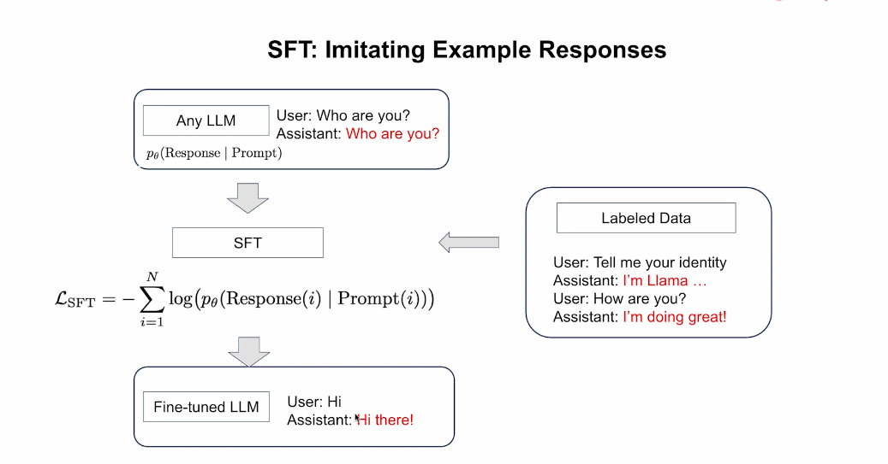
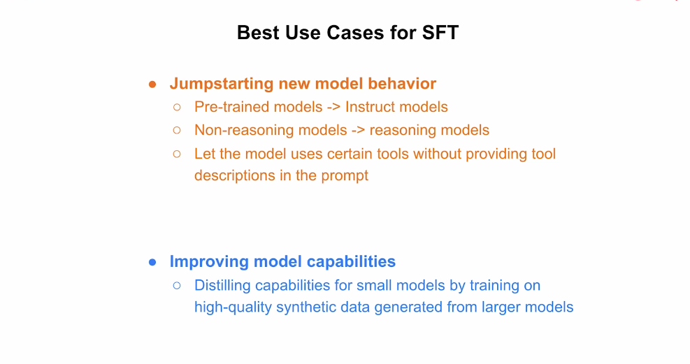
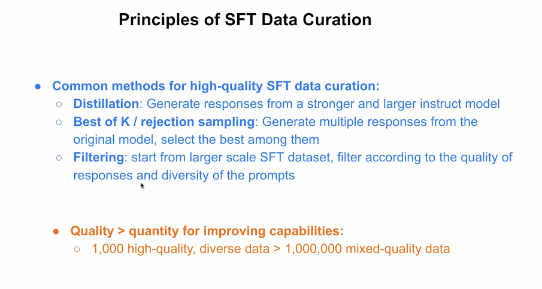
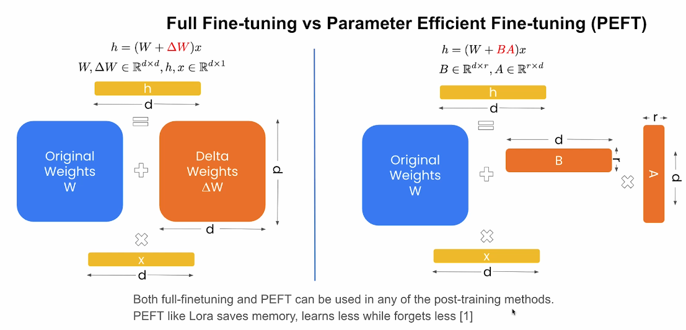

# 2. Supervised Fine-Tuning — SFT

[← Retour au README](../README.md)

## Introduction

Un modèle de base pré-entraîné sait surtout prédire la suite probable d’un texte.

Il ne comprend pas toujours qu’il doit répondre directement à une question ou suivre précisément une instruction.

Le **Supervised Fine-Tuning**, ou SFT, permet de transformer ce modèle généraliste en modèle d’instruction en lui montrant de nombreux exemples de réponses idéales.

---

## Le principe du Supervised Fine-Tuning



*Cette diapositive montre comment un modèle de base apprend à produire des réponses adaptées grâce à des exemples étiquetés.*

Au départ, un modèle de base peut simplement continuer le texte reçu.

Par exemple, face au prompt :

```text
Who are you?
```

il pourrait répéter :

```text
Who are you?
```

au lieu de répondre.

> **Modèle de base** : modèle pré-entraîné capable de générer du texte, mais pas encore spécialisé dans le suivi d’instructions.

Pour corriger ce comportement, on lui fournit des données étiquetées.

Exemple :

```text
Utilisateur :
Tell me your identity

Assistant :
I’m Llama...
```

Autre exemple :

```text
Utilisateur :
How are you?

Assistant :
I’m doing great!
```

> **Données étiquetées** : exemples contenant une entrée et une réponse correcte attendue.

---

## Le modèle apprend à imiter

Pendant le SFT, le modèle apprend à rendre les réponses idéales plus probables.

Il reçoit :

```text
Prompt
+
Réponse idéale
```

La fonction de perte mesure l’écart entre la réponse prédite et la réponse attendue.

> **Prompt** : question ou instruction donnée au modèle.

> **Fonction de perte** : valeur qui mesure l’écart entre la sortie du modèle et la réponse attendue.

> **Log-vraisemblance négative** : calcul qui pénalise le modèle lorsqu’il attribue une faible probabilité à la bonne réponse.

L’entraînement cherche à réduire cette perte.

À la fin, le modèle de base devient un modèle d’instruction.

> **Modèle d’instruction — Instruct model** : modèle entraîné pour comprendre et suivre les demandes des utilisateurs.

En résumé :

```text
Modèle de base
→ prédit du texte

SFT
→ apprend à répondre
```

---

## Les meilleurs cas d’usage du SFT



*Cette diapositive distingue deux grands usages : créer un nouveau comportement et améliorer les capacités d’un petit modèle.*

## 1. Créer un nouveau comportement

Le SFT peut transformer :

- un modèle pré-entraîné en modèle d’instruction ;
- un modèle classique en modèle de raisonnement ;
- un modèle en assistant capable d’utiliser certains outils ;
- un modèle généraliste en modèle spécialisé.

> **SFT — Supervised Fine-Tuning** : entraînement supervisé à partir d’exemples de réponses idéales.

> **Modèle pré-entraîné** : modèle qui sait générer du texte, mais ne suit pas toujours correctement les consignes.

> **Modèle d’instruction** : modèle entraîné pour répondre aux demandes des utilisateurs.

> **Modèle de raisonnement** : modèle capable de résoudre des problèmes en plusieurs étapes.

> **Outil** : fonction externe que le modèle peut appeler, comme une calculatrice, une base de données ou une API.

### Exemple : apprendre l’utilisation d’un outil

On peut fournir au modèle des exemples comme :

```text
Utilisateur :
Quelle est la météo à Paris ?

Assistant :
Appel de l’outil météo avec :
ville = Paris
```

Le modèle apprend alors non seulement quoi répondre, mais aussi quand et comment utiliser l’outil.

---

## 2. Améliorer les capacités d’un petit modèle

Un petit modèle peut apprendre à partir de réponses produites par un modèle plus puissant.

Cette méthode s’appelle la distillation.

> **Distillation** : transfert des capacités d’un grand modèle vers un modèle plus petit.

Le grand modèle produit des réponses de haute qualité.

Ces réponses sont ensuite utilisées comme données d’entraînement pour le petit modèle.

```text
Grand modèle
      ↓
Réponses de haute qualité
      ↓
Données synthétiques
      ↓
Petit modèle entraîné
```

> **Données synthétiques** : données générées artificiellement par un modèle plutôt que rédigées par des humains.

Le SFT peut donc servir à :

```text
Créer un nouveau comportement
ou
Transférer les capacités d’un grand modèle
```

---

## Créer des données SFT de qualité



*Cette diapositive présente la distillation, le Best of K, le filtrage et l’importance de privilégier la qualité à la quantité.*

La qualité des données est essentielle.

Comme le modèle imite les exemples fournis, de mauvaises données peuvent directement dégrader ses performances.

Trois méthodes principales permettent de construire un bon jeu de données.

---

## 1. La distillation

La distillation utilise un grand modèle pour générer des réponses destinées à entraîner un modèle plus petit.

```text
Prompt
   ↓
Grand modèle
   ↓
Réponse de haute qualité
   ↓
Donnée d’entraînement
```

Avantages :

- génération rapide de nombreuses réponses ;
- qualité supérieure à celle du petit modèle ;
- possibilité de spécialiser un modèle compact.

Limites :

- les erreurs du grand modèle peuvent être reproduites ;
- le style du modèle enseignant peut dominer les données ;
- la diversité doit être contrôlée.

---

## 2. Best of K et rejection sampling

La méthode **Best of K** consiste à générer plusieurs réponses pour un même prompt.

Exemple :

```text
Prompt
  ↓
Réponse 1
Réponse 2
Réponse 3
Réponse 4
```

On conserve ensuite seulement la meilleure.

> **Best of K** : méthode qui génère plusieurs réponses puis sélectionne la meilleure.

> **Rejection sampling** : méthode qui rejette les réponses de faible qualité et conserve les meilleures.

La sélection peut être réalisée par :

- un humain ;
- un modèle juge ;
- une fonction de score ;
- des règles automatiques.

---

## 3. Le filtrage

Le filtrage part d’un grand jeu de données existant et supprime les exemples faibles.

On peut retirer :

- les réponses incorrectes ;
- les réponses répétitives ;
- les prompts trop similaires ;
- les réponses trop vagues ;
- les formats incorrects ;
- les exemples dangereux ;
- les données peu représentatives.

> **Curation des données** : sélection, nettoyage et organisation des exemples utilisés pour l’entraînement.

> **Diversité des prompts** : variété des questions, tâches, styles et formulations présents dans les données.

---

## Qualité plutôt que quantité

L’idée centrale du cours est :

```text
1 000 exemples excellents et variés
peuvent être plus utiles que
1 000 000 d’exemples de qualité inégale
```

Une grande quantité de données faibles peut apprendre au modèle :

- de mauvaises réponses ;
- des raisonnements incorrects ;
- des formulations répétitives ;
- des comportements indésirables.

Le SFT reproduit ce qu’on lui montre.

La qualité de la sélection est donc souvent plus importante que le volume brut.

---

## Construire un bon jeu de données

Un bon jeu de données SFT doit idéalement être :

- exact ;
- varié ;
- représentatif du cas d’usage ;
- cohérent ;
- bien formaté ;
- équilibré ;
- exempt de doublons inutiles ;
- évalué avant l’entraînement.

### Exemple de structure

```text
{
  "messages": [
    {
      "role": "user",
      "content": "Explique la quantification."
    },
    {
      "role": "assistant",
      "content": "La quantification consiste à..."
    }
  ]
}
```

Le format doit être identique à celui utilisé lors de l’inférence finale.

---

## Fine-tuning complet et PEFT



*Cette diapositive compare la modification directe de tous les poids avec l’ajout de petites matrices entraînables dans une méthode PEFT comme LoRA.*

Deux grandes approches permettent d’appliquer le SFT :

1. le fine-tuning complet ;
2. le Parameter-Efficient Fine-Tuning.

---

## 1. Fine-tuning complet

Dans le fine-tuning complet, une grande partie ou la totalité des poids du modèle est modifiée.

On peut représenter cette modification ainsi :

```text
Poids finaux
=
Poids d’origine
+
ΔW
```

> **Poids — Weights** : valeurs numériques internes apprises par le modèle.

> **ΔW** : matrice représentant les modifications ajoutées aux poids d’origine.

> **Fine-tuning complet** : méthode qui ajuste une grande partie, voire la totalité, des paramètres du modèle.

### Avantages

- forte capacité d’adaptation ;
- possibilité de modifier profondément le comportement ;
- apprentissage plus important.

### Limites

- forte consommation de mémoire ;
- coût de calcul élevé ;
- stockage d’un nouveau modèle complet ;
- risque plus important d’oublier certaines capacités d’origine.

---

## 2. PEFT

Le PEFT conserve les poids d’origine et n’entraîne qu’un petit nombre de paramètres supplémentaires.

> **PEFT — Parameter-Efficient Fine-Tuning** : fine-tuning qui ne modifie qu’une petite partie des paramètres.

Une méthode populaire est LoRA.

> **LoRA — Low-Rank Adaptation** : méthode PEFT qui ajoute deux petites matrices entraînables au modèle.

Au lieu d’apprendre directement une grande matrice :

```text
ΔW
```

LoRA apprend deux matrices plus petites :

```text
A
et
B
```

Leur produit approxime la correction :

```text
ΔW ≈ B × A
```

---

## Pourquoi LoRA utilise moins de paramètres

La dimension intermédiaire utilisée par LoRA est beaucoup plus petite que la dimension complète du modèle.

```text
r << d
```

où :

- `d` est la dimension principale ;
- `r` est le rang réduit.

Cela réduit fortement :

- le nombre de paramètres entraînables ;
- la mémoire nécessaire ;
- le temps d’entraînement ;
- la taille du fichier final.

---

## Comparaison

| Critère | Fine-tuning complet | PEFT / LoRA |
|---|---|---|
| Paramètres modifiés | Beaucoup ou tous | Petit nombre |
| Mémoire | Élevée | Faible |
| Coût | Élevé | Réduit |
| Capacité d’adaptation | Très forte | Plus limitée |
| Risque d’oubli | Plus élevé | Plus faible |
| Taille du résultat | Modèle complet | Petit adaptateur |

En résumé :

```text
Fine-tuning complet
→ apprend davantage
→ coûte davantage
→ peut oublier davantage

PEFT / LoRA
→ apprend moins
→ coûte moins
→ préserve mieux les capacités d’origine
```

---

## Utilisation avec d’autres méthodes

Le fine-tuning complet et le PEFT ne sont pas limités au SFT.

Ils peuvent aussi être utilisés avec :

- la DPO ;
- le reinforcement learning ;
- d’autres méthodes de post-entraînement.

Ils décrivent **quels paramètres sont entraînés**, tandis que SFT, DPO et RL décrivent **quel objectif d’apprentissage est utilisé**.

```text
Méthode d’apprentissage :
SFT / DPO / RL

Méthode de mise à jour :
Fine-tuning complet / PEFT
```

---

## Quand choisir le SFT ?

Le SFT est particulièrement adapté pour :

- enseigner un nouveau format de réponse ;
- transformer un modèle de base en modèle d’instruction ;
- enseigner l’utilisation d’outils ;
- transférer les capacités d’un grand modèle ;
- apprendre un style ou un comportement précis ;
- améliorer un petit modèle avec des données synthétiques ;
- créer une base avant une phase de DPO ou de RL.

---

## Limites du SFT

Le SFT présente aussi certaines limites.

### Imitation des erreurs

Le modèle peut reproduire les erreurs contenues dans les données.

### Manque de préférences

Le SFT montre une réponse idéale, mais ne montre pas toujours pourquoi elle est meilleure qu’une autre.

### Couverture limitée

Le modèle ne voit qu’un nombre limité de situations.

### Dégradation possible

Un entraînement trop ciblé peut détériorer certaines capacités générales.

### Dépendance aux données

La qualité finale dépend fortement de la curation du jeu de données.

---

## Ce que je retiens

Le SFT transforme un modèle de base en modèle capable de suivre des instructions.

Il repose sur l’imitation de réponses idéales présentes dans des données étiquetées.

Ses principaux cas d’usage sont :

- créer un nouveau comportement ;
- transférer les capacités d’un grand modèle vers un plus petit ;
- enseigner l’utilisation d’outils ;
- préparer le modèle pour d’autres méthodes de post-entraînement.

La qualité des données est essentielle.

La distillation, le Best of K et le filtrage permettent de construire de meilleurs jeux de données.

Enfin, le SFT peut être appliqué avec un fine-tuning complet ou avec une méthode PEFT comme LoRA.

---

## Concepts clés

- SFT
- Supervised Fine-Tuning
- Modèle de base
- Modèle d’instruction
- Données étiquetées
- Fonction de perte
- Log-vraisemblance négative
- Distillation
- Données synthétiques
- Best of K
- Rejection sampling
- Filtrage
- Curation des données
- Fine-tuning complet
- PEFT
- LoRA
- Poids
- Matrice
- Rang

---

[← Chapitre précédent](01-introduction.md) | [Chapitre suivant : Direct Preference Optimization →](03-direct-preference-optimization.md)
