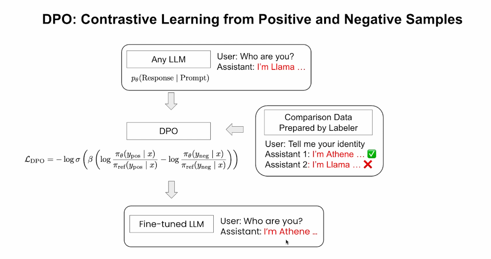
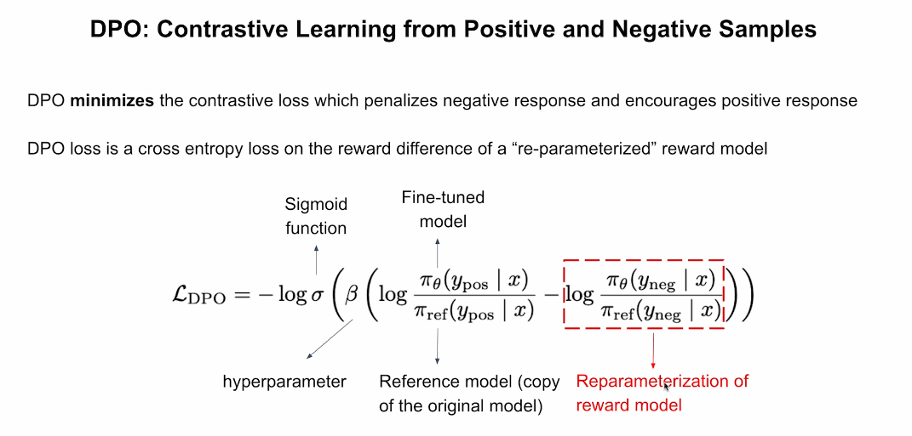
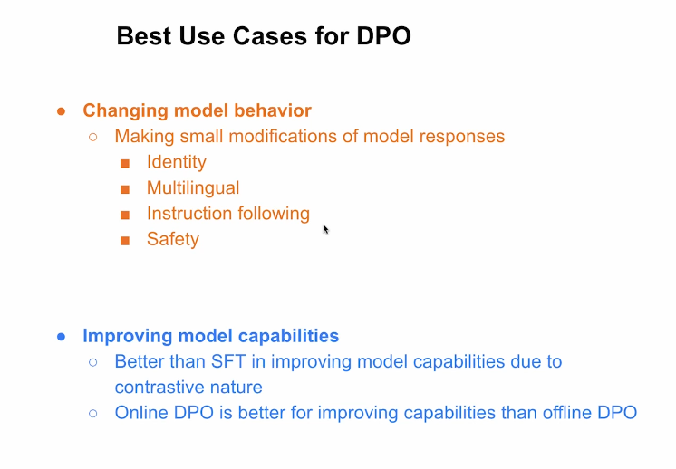
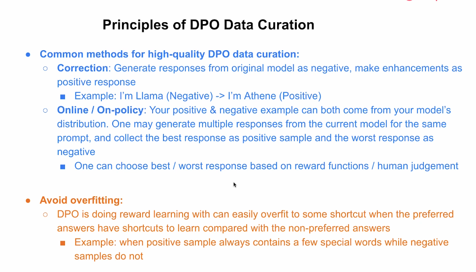

# 3. Direct Preference Optimization — DPO

[← Retour au README](../README.md)

## Introduction

La **Direct Preference Optimization**, ou DPO, est une méthode de post-entraînement qui apprend au modèle à préférer une réponse à une autre pour un même prompt.

Contrairement au SFT, qui montre uniquement une réponse idéale, la DPO utilise une comparaison explicite entre :

- une réponse préférée ;
- une réponse rejetée.

Le modèle apprend ainsi ce qu’il doit favoriser et ce qu’il doit éviter.

---

## Le principe de la DPO



*Cette diapositive montre comment la DPO utilise une réponse positive et une réponse négative pour modifier le comportement du modèle.*

Imaginons qu’un modèle réponde initialement :

```text
Je suis Llama.
```

Pour modifier son identité, on crée une paire de comparaison :

```text
Réponse préférée :
Je suis Athene.

Réponse rejetée :
Je suis Llama.
```

> **DPO — Direct Preference Optimization** : méthode de post-entraînement qui compare une bonne et une mauvaise réponse pour un même prompt.

> **Apprentissage contrastif** : méthode fondée sur l’opposition entre un exemple positif et un exemple négatif.

> **Labeler** : humain ou modèle chargé d’indiquer quelle réponse est préférable.

---

## Ce que la fonction de perte apprend

La fonction de perte pousse le modèle à :

- augmenter la probabilité de la réponse préférée ;
- diminuer la probabilité de la réponse rejetée.

> **Fonction de perte** : calcul utilisé pour mesurer l’erreur du modèle pendant l’entraînement.

Après l’entraînement, lorsque l’utilisateur pose la même question, le modèle répond plus probablement :

```text
Je suis Athene.
```

La DPO ne lui enseigne donc pas seulement une réponse.

Elle lui apprend une relation de préférence :

```text
Réponse A
>
Réponse B
```

---

## Le rôle du modèle de référence

La DPO compare le modèle entraîné à une copie fixe du modèle d’origine.

> **Modèle de référence** : modèle non modifié utilisé comme point de comparaison pendant l’entraînement.

Cette référence permet d’éviter que le modèle change trop brutalement.

Le but est de modifier le comportement ciblé sans détruire les capacités générales déjà acquises.

```text
Modèle entraîné
comparé à
Modèle de référence
```

---

## La formule DPO



*Cette diapositive détaille les différents éléments de la fonction de perte DPO.*

La DPO minimise une perte contrastive.

Pour un même prompt, elle compare :

```text
y_pos
```

la réponse positive, et :

```text
y_neg
```

la réponse négative.

> **Perte contrastive** : fonction qui rapproche le modèle des bons exemples et l’éloigne des mauvais.

La formule compare les probabilités attribuées par :

- le modèle entraîné ;
- le modèle de référence.

---

## Le modèle entraîné

Le modèle entraîné est souvent noté :

```text
πθ
```

Il s’agit du modèle dont les paramètres sont mis à jour.

Son objectif est de rendre la réponse positive plus probable que la réponse négative.

---

## Le modèle de référence

Le modèle de référence est souvent noté :

```text
πref
```

Il reste fixe pendant l’entraînement.

Il sert de garde-fou pour mesurer l’écart entre :

- le comportement initial ;
- le comportement appris.

---

## Reparamétrisation du modèle de récompense

La DPO exprime une récompense directement à partir des probabilités du modèle.

> **Reparamétrisation du modèle de récompense** : manière de construire un signal de préférence sans entraîner un modèle de récompense séparé.

La différence entre les scores attribués à la bonne et à la mauvaise réponse agit comme une récompense implicite.

```text
Score positif
-
Score négatif
=
Signal de préférence
```

---

## La sigmoïde

La sigmoïde transforme cette différence en une valeur comprise entre 0 et 1.

> **Sigmoïde** : fonction mathématique utilisée pour représenter la probabilité que la réponse positive soit préférée.

Une grande différence en faveur de la réponse positive produit une valeur proche de 1.

Une faible différence produit une valeur plus proche de 0,5.

---

## Le rôle du paramètre β

Le paramètre β contrôle l’intensité de l’apprentissage.

> **Hyperparamètre β** : valeur choisie avant l’entraînement pour régler l’importance de la préférence et l’écart autorisé par rapport au modèle de référence.

On peut le comprendre ainsi :

```text
β faible
→ changements plus limités

β élevé
→ préférence renforcée plus fortement
```

L’objectif est de trouver un équilibre :

```text
Améliorer la préférence
sans trop éloigner le modèle
de son comportement d’origine
```

---

## Meilleurs cas d’usage de la DPO



*Cette diapositive présente deux grandes utilisations : modifier le comportement du modèle et améliorer certaines capacités.*

## 1. Modifier le comportement du modèle

La DPO est adaptée aux modifications ciblées.

Exemples :

- changer l’identité du modèle ;
- améliorer les réponses multilingues ;
- renforcer le suivi des instructions ;
- améliorer la sécurité ;
- modifier le style de réponse ;
- ajuster le niveau de concision.

> **Comportement du modèle** : manière habituelle dont le modèle formule ses réponses.

> **Suivi d’instructions** : capacité à respecter précisément les contraintes d’un prompt.

La DPO est particulièrement utile lorsque le changement recherché est clair et peut être exprimé par une préférence.

---

## Exemple : style de réponse

Pour un même prompt :

```text
Explique la quantification.
```

Réponse préférée :

```text
La quantification réduit la précision numérique des poids afin de diminuer la mémoire nécessaire.
```

Réponse rejetée :

```text
C’est un truc qui rend les modèles plus petits.
```

Le modèle apprend à préférer une réponse :

- plus précise ;
- plus informative ;
- mieux formulée.

---

## 2. Améliorer les capacités

La DPO peut parfois améliorer certaines compétences plus efficacement que le SFT.

La raison est sa nature contrastive.

Le modèle ne voit pas seulement ce qu’il doit produire.

Il voit également ce qu’il doit éviter.

```text
SFT
→ imiter une bonne réponse

DPO
→ distinguer une bonne réponse d’une mauvaise
```

Cette comparaison peut fournir un signal d’apprentissage plus précis.

---

## DPO en ligne et DPO hors ligne

Deux configurations principales existent.

### DPO hors ligne

Les réponses comparées proviennent d’un jeu de données déjà préparé.

```text
Dataset fixe
→ réponse préférée
→ réponse rejetée
```

> **DPO hors ligne** : DPO utilisant des comparaisons collectées avant l’entraînement.

Avantages :

- simple à reproduire ;
- données faciles à inspecter ;
- entraînement stable.

Limites :

- les réponses peuvent ne plus correspondre au comportement actuel du modèle ;
- le jeu de données peut couvrir mal ses erreurs récentes.

---

## DPO en ligne

En DPO en ligne, les réponses sont générées par le modèle actuel pendant l’entraînement.

> **DPO en ligne — On-policy DPO** : méthode dans laquelle les exemples sont produits par le modèle actuellement entraîné.

Le processus peut être :

```text
1. Envoyer un prompt
2. Générer plusieurs réponses
3. Évaluer les réponses
4. Choisir la meilleure
5. Choisir la pire
6. Former une paire de préférence
7. Entraîner le modèle
```

Cette approche peut mieux cibler les erreurs actuelles du modèle.

---

## Comparaison

| Critère | DPO hors ligne | DPO en ligne |
|---|---|---|
| Source des réponses | Dataset préparé | Modèle actuel |
| Actualité des erreurs | Plus faible | Élevée |
| Coût | Plus faible | Plus élevé |
| Complexité | Plus simple | Plus complexe |
| Adaptation au modèle | Limitée | Forte |

Le document indique que la DPO en ligne peut être plus efficace pour améliorer certaines capacités.

---

## Curation des données DPO



*Cette diapositive présente la méthode par correction, la DPO en ligne et les risques de surapprentissage.*

La qualité des paires de préférence est essentielle.

Une bonne paire doit représenter une vraie différence de qualité.

---

## 1. Méthode par correction

On part d’une réponse produite par le modèle.

Cette réponse devient l’exemple négatif.

On la corrige ensuite pour créer l’exemple positif.

Exemple :

```text
Réponse rejetée :
Je suis Llama.

Réponse préférée :
Je suis Athene.
```

> **Correction** : amélioration directe d’une réponse existante afin de créer un meilleur exemple.

Cette méthode garantit que les deux réponses restent proches, tout en présentant une différence claire.

---

## Exemple de correction plus complexe

Prompt :

```text
Explique la différence entre SFT et DPO.
```

Réponse rejetée :

```text
Le SFT et la DPO sont deux types de fine-tuning.
```

Réponse préférée :

```text
Le SFT apprend à imiter une réponse idéale, tandis que la DPO apprend à préférer une réponse à une autre.
```

La correction améliore :

- la précision ;
- la complétude ;
- la clarté.

---

## 2. Générer plusieurs réponses

Le modèle peut générer plusieurs réponses pour un même prompt.

```text
Réponse A
Réponse B
Réponse C
Réponse D
```

On sélectionne ensuite :

- la meilleure comme réponse positive ;
- la pire comme réponse négative.

Le choix peut être effectué par :

- un humain ;
- un LLM juge ;
- une fonction de récompense ;
- des règles automatiques.

> **Fonction de récompense** : système qui attribue un score à une réponse.

---

## Choisir de vraies différences de qualité

Une bonne paire DPO ne doit pas uniquement présenter des différences superficielles.

Elle doit comparer des dimensions importantes comme :

- l’exactitude ;
- la pertinence ;
- le suivi d’instructions ;
- la sécurité ;
- la qualité du raisonnement ;
- la clarté ;
- la concision ;
- le respect du format.

---

## Éviter le surapprentissage

Le modèle peut apprendre des raccourcis artificiels.

Par exemple, si toutes les réponses préférées contiennent toujours une expression particulière, il peut apprendre à préférer cette expression sans comprendre la qualité réelle de la réponse.

> **Surapprentissage — Overfitting** : situation où le modèle mémorise des détails particuliers du jeu de données au lieu d’apprendre une règle générale.

> **Raccourci** : indice superficiel utilisé par le modèle à la place d’un raisonnement réel.

---

## Exemple de mauvais dataset

Réponses positives :

```text
Excellent ! Voici la bonne réponse...
```

Réponses négatives :

```text
Je ne sais pas...
```

Le modèle peut apprendre que le mot :

```text
Excellent
```

est toujours associé à une bonne réponse.

Il ne juge alors plus la qualité du contenu.

---

## Prévenir les raccourcis

Pour réduire ce risque, il faut :

- varier les styles des réponses positives ;
- varier les styles des réponses négatives ;
- éviter les mots marqueurs systématiques ;
- contrôler les différences de longueur ;
- comparer le contenu et pas seulement la forme ;
- utiliser plusieurs sources de données ;
- tester le modèle sur des prompts non vus.

---

## SFT et DPO : rôles complémentaires

Le SFT et la DPO ne sont pas nécessairement concurrents.

Ils sont souvent utilisés successivement.

```text
Modèle de base
      ↓
SFT
      ↓
Modèle d’instruction
      ↓
DPO
      ↓
Modèle mieux aligné sur les préférences
```

Le SFT apprend une base de comportement.

La DPO affine ensuite les préférences.

---

## Comparaison SFT et DPO

| Élément | SFT | DPO |
|---|---|---|
| Données | Prompt + réponse idéale | Prompt + réponse préférée + réponse rejetée |
| Signal | Imitation | Comparaison |
| Objectif | Produire une bonne réponse | Préférer la meilleure |
| Modèle de référence | Non requis | Généralement utilisé |
| Force | Apprendre un nouveau comportement | Affiner des préférences |
| Risque | Imiter les erreurs | Apprendre des raccourcis |

---

## Quand choisir la DPO ?

La DPO est adaptée lorsque :

- le modèle sait déjà répondre ;
- les différences entre bonnes et mauvaises réponses sont identifiables ;
- on veut ajuster un comportement précis ;
- on dispose de données de préférence ;
- on veut éviter un pipeline RLHF plus complexe ;
- on veut améliorer le suivi d’instructions ou la sécurité.

Elle est moins adaptée lorsque le modèle ne possède encore aucune base solide.

Dans ce cas, le SFT est souvent nécessaire en premier.

---

## Limites de la DPO

### Dépendance aux préférences

La qualité finale dépend de la qualité des comparaisons.

### Biais des labelers

Les humains ou modèles juges peuvent avoir des préférences biaisées.

### Surapprentissage

Le modèle peut exploiter des indices artificiels.

### Couverture limitée

Le dataset peut ne pas représenter tous les comportements possibles.

### Choix de β

Un mauvais réglage peut produire des changements trop faibles ou trop importants.

---

## Ce que je retiens

La DPO apprend au modèle à préférer une réponse positive à une réponse négative.

Elle utilise une perte contrastive et compare le modèle entraîné à une version de référence.

Le paramètre β contrôle l’intensité du changement.

La DPO est particulièrement adaptée pour :

- modifier un comportement précis ;
- améliorer le suivi d’instructions ;
- renforcer la sécurité ;
- affiner certaines capacités.

La qualité des données est essentielle.

Les paires doivent représenter de vraies différences de qualité et éviter les raccourcis artificiels.

Enfin, le SFT et la DPO sont complémentaires : le SFT construit une base de comportement, puis la DPO affine les préférences.

---

## Concepts clés

- DPO
- Direct Preference Optimization
- Apprentissage contrastif
- Réponse préférée
- Réponse rejetée
- Labeler
- Fonction de perte
- Modèle de référence
- Sigmoïde
- Hyperparamètre β
- DPO en ligne
- DPO hors ligne
- On-policy
- Fonction de récompense
- Curation des données
- Correction
- Surapprentissage
- Raccourci
- Préférence

---

[← Chapitre précédent](02-supervised-fine-tuning.md) | [Chapitre suivant : Reinforcement Learning →](04-reinforcement-learning.md)
