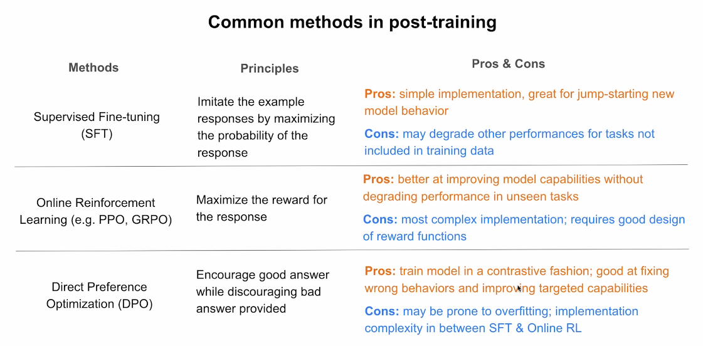
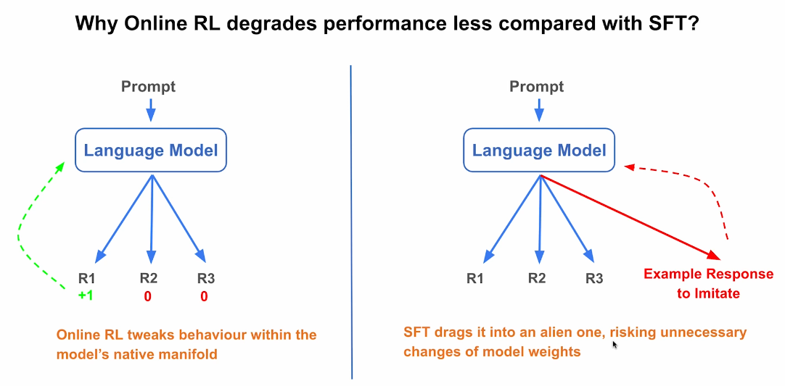

# 5. Conclusion — Comparer les méthodes de post-training

[← Retour au README](../README.md)

## Introduction

Les principales méthodes de post-entraînement étudiées dans ce cours sont :

- le Supervised Fine-Tuning ;
- la Direct Preference Optimization ;
- l’apprentissage par renforcement en ligne.

Elles poursuivent toutes le même objectif général :

```text
Améliorer le comportement ou les capacités d’un modèle déjà pré-entraîné
```

Mais elles utilisent des signaux d’apprentissage différents et présentent des niveaux de complexité, de coût et de risque distincts.

---

## Comparaison générale des méthodes



*Cette diapositive compare le principe, les avantages et les limites des trois principales méthodes de post-entraînement.*

## Supervised Fine-Tuning

Le SFT apprend au modèle à imiter des réponses idéales fournies dans les données.

```text
Prompt
+
Réponse idéale
→
Imitation
```

> **SFT — Supervised Fine-Tuning** : entraînement supervisé fondé sur des couples prompt-réponse idéale.

### Avantages

- implémentation relativement simple ;
- apprentissage rapide d’un nouveau comportement ;
- transformation d’un modèle de base en modèle d’instruction ;
- apprentissage d’un format ou d’un style de réponse ;
- transfert de capacités par distillation.

### Limites

- dépend fortement de la qualité des données ;
- peut reproduire les erreurs présentes dans les exemples ;
- peut dégrader les capacités absentes du jeu d’entraînement ;
- peut pousser le modèle vers des réponses éloignées de son comportement naturel.

---

## Direct Preference Optimization

La DPO apprend au modèle à préférer une bonne réponse et à éviter une mauvaise.

```text
Prompt
+
Réponse préférée
+
Réponse rejetée
→
Apprentissage contrastif
```

> **Apprentissage contrastif** : apprentissage fondé sur la comparaison entre un exemple préféré et un exemple rejeté.

### Avantages

- utile pour corriger un comportement précis ;
- efficace pour améliorer une capacité ciblée ;
- plus informative que le SFT lorsqu’on dispose de comparaisons ;
- pipeline plus simple qu’un apprentissage par renforcement complet.

### Limites

- risque de surapprentissage ;
- dépend fortement de la qualité des paires de préférence ;
- peut apprendre des raccourcis artificiels ;
- complexité intermédiaire.

> **Surapprentissage** : apprentissage excessif de détails propres aux données au lieu d’une règle générale.

---

## Apprentissage par renforcement en ligne

Le modèle génère ses propres réponses, reçoit une récompense, puis apprend à maximiser cette récompense.

```text
Prompt
→
Réponse générée
→
Récompense
→
Mise à jour du modèle
```

> **Fonction de récompense** : système qui attribue un score aux réponses.

Les algorithmes étudiés dans le cours sont notamment :

- PPO ;
- GRPO.

### Avantages

- permet au modèle d’explorer de nouvelles réponses ;
- peut améliorer fortement certaines capacités ;
- peut préserver davantage les performances sur les tâches non entraînées ;
- adapté aux tâches vérifiables et au raisonnement.

### Limites

- implémentation plus complexe ;
- besoin d’une fonction de récompense fiable ;
- coût de calcul élevé ;
- risque de reward hacking ;
- pipeline plus difficile à stabiliser.

---

## Comparaison synthétique

| Critère | SFT | DPO | RL en ligne |
|---|---|---|---|
| Signal d’apprentissage | Réponse idéale | Préférence | Récompense |
| Complexité | Faible | Moyenne | Élevée |
| Données | Prompt-réponse | Préférée-rejetée | Prompts + génération + score |
| Exploration | Non | Limitée | Oui |
| Idéal pour | Nouveau comportement | Correction ciblée | Optimisation avancée |
| Risque principal | Dégradation | Surapprentissage | Reward hacking |

---

## Niveau de complexité

On peut représenter les trois méthodes ainsi :

```text
SFT
→ le plus simple

DPO
→ complexité intermédiaire

RL en ligne
→ le plus complexe
```

Mais la méthode la plus complexe peut aussi être la plus puissante lorsqu’elle est correctement configurée.

---

## Pourquoi le RL en ligne peut moins dégrader le modèle



*Cette diapositive explique que le RL en ligne ajuste des réponses déjà accessibles au modèle, alors que le SFT peut l’obliger à imiter une réponse éloignée de son comportement naturel.*

## Le manifold natif du modèle

Pendant le RL en ligne, le modèle génère plusieurs réponses qu’il sait déjà produire.

Exemple :

```text
R1
R2
R3
```

Une récompense indique ensuite lesquelles sont les meilleures.

Le modèle ajuste légèrement leur probabilité.

> **Manifold natif du modèle** : ensemble des réponses et comportements déjà naturellement accessibles au modèle.

Le modèle reste donc proche de son espace de comportement existant.

```text
Réponses déjà accessibles
→
petits ajustements
→
meilleures probabilités
```

---

## Le fonctionnement du SFT

Le SFT fournit une réponse préparée que le modèle doit imiter.

Cette réponse peut être très différente de ce que le modèle aurait naturellement généré.

```text
Comportement naturel du modèle
        ↓
Réponse externe à imiter
        ↓
Modification plus importante des poids
```

Cela peut provoquer des changements plus importants dans les paramètres.

> **Poids du modèle** : valeurs internes qui déterminent son comportement et ses réponses.

---

## Différence fondamentale

Le RL en ligne améliore les réponses déjà présentes dans l’espace de comportement du modèle.

Le SFT peut pousser le modèle vers un comportement plus éloigné.

```text
RL en ligne
→ améliore ce que le modèle sait déjà produire

SFT
→ apprend à imiter une réponse externe
```

Cette différence peut expliquer pourquoi le RL en ligne dégrade parfois moins les capacités générales.

---

## Exemple intuitif

Supposons qu’un modèle puisse déjà générer trois réponses :

```text
R1 : correcte mais trop longue
R2 : correcte et concise
R3 : incorrecte
```

Avec le RL en ligne :

```text
R2 reçoit la meilleure récompense
→ sa probabilité augmente
```

Le modèle reste dans un espace de réponses qu’il maîtrisait déjà.

Avec le SFT, on peut lui fournir une quatrième réponse très différente :

```text
R4 : formulation entièrement nouvelle
```

Le modèle doit alors modifier davantage ses paramètres pour l’imiter.

---

## Cela ne signifie pas que le RL est toujours meilleur

Le RL en ligne présente aussi des risques importants.

### Mauvaise fonction de récompense

Le modèle peut apprendre à maximiser un score imparfait.

### Reward hacking

Il peut exploiter une faille dans la fonction de récompense sans réellement accomplir la tâche.

### Coût

Il faut générer et évaluer de nombreuses réponses.

### Instabilité

Les mises à jour peuvent être difficiles à contrôler.

Le choix dépend donc du cas d’usage.

---

## Quand choisir le SFT ?

Le SFT est adapté lorsque :

- le modèle de base ne sait pas encore suivre les instructions ;
- on veut enseigner un nouveau format ;
- on dispose de réponses idéales ;
- on veut créer rapidement un comportement ;
- on prépare le modèle pour une phase ultérieure de DPO ou de RL.

---

## Quand choisir la DPO ?

La DPO est adaptée lorsque :

- le modèle sait déjà répondre ;
- on dispose de comparaisons de préférence ;
- on veut corriger un comportement précis ;
- on veut améliorer la sécurité ;
- on veut affiner le style ou le suivi d’instructions ;
- on souhaite éviter un pipeline RL trop complexe.

---

## Quand choisir le RL en ligne ?

Le RL en ligne est adapté lorsque :

- le modèle doit explorer de nouvelles stratégies ;
- on dispose d’une bonne fonction de récompense ;
- les réponses peuvent être vérifiées ;
- on veut améliorer le raisonnement ;
- on entraîne des agents ;
- on dispose de ressources de calcul suffisantes.

---

## Pipeline courant de post-entraînement

Dans la pratique, les méthodes peuvent être combinées.

```text
Modèle pré-entraîné
        ↓
SFT
        ↓
Modèle d’instruction
        ↓
DPO
        ↓
Meilleur alignement
        ↓
RL en ligne
        ↓
Optimisation avancée
```

Chaque étape remplit un rôle différent.

### SFT

Construit le comportement de base.

### DPO

Affina les préférences.

### RL en ligne

Optimise une récompense et permet l’exploration.

---

## Choisir selon les données disponibles

| Données disponibles | Méthode adaptée |
|---|---|
| Réponses idéales | SFT |
| Paires préférée-rejetée | DPO |
| Fonction de récompense | RL en ligne |
| Réponses vérifiables | RL avec récompense vérifiable |
| Peu de ressources | SFT ou DPO |
| Forte capacité de calcul | RL en ligne |

---

## Choisir selon l’objectif

| Objectif | Méthode |
|---|---|
| Suivre des instructions | SFT |
| Corriger un style | DPO |
| Améliorer la sécurité | DPO ou RL |
| Apprendre à utiliser des outils | SFT puis RL |
| Améliorer le raisonnement | RL en ligne |
| Compresser les capacités d’un grand modèle | SFT par distillation |
| Optimiser une métrique précise | RL |

---

## Ce que je retiens

Le SFT est la méthode la plus simple et la plus directe.

Il apprend au modèle à imiter des réponses idéales.

La DPO ajoute un signal contrastif en comparant une réponse préférée à une réponse rejetée.

L’apprentissage par renforcement en ligne permet au modèle d’explorer ses propres réponses et d’optimiser une récompense.

Le RL en ligne peut parfois préserver davantage les capacités générales parce qu’il ajuste des réponses déjà accessibles au modèle.

Cependant, il est aussi plus complexe, plus coûteux et plus dépendant de la qualité de la fonction de récompense.

Le choix de la méthode doit donc dépendre :

- du comportement recherché ;
- des données disponibles ;
- des ressources matérielles ;
- du niveau de risque acceptable ;
- de la capacité à évaluer correctement les réponses.

---

## Concepts clés

- SFT
- DPO
- Reinforcement Learning
- Réponse idéale
- Réponse préférée
- Réponse rejetée
- Apprentissage contrastif
- Fonction de récompense
- PPO
- GRPO
- Manifold natif
- Poids du modèle
- Surapprentissage
- Reward hacking
- Dégradation
- Exploration
- Post-entraînement

---

[← Chapitre précédent](04-reinforcement-learning.md) | [Retour au README →](../README.md)
